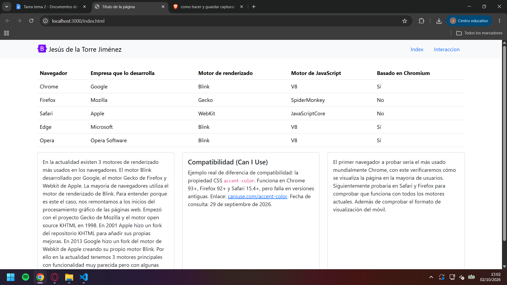
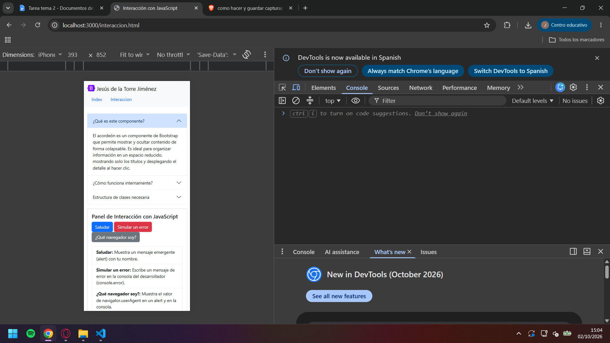
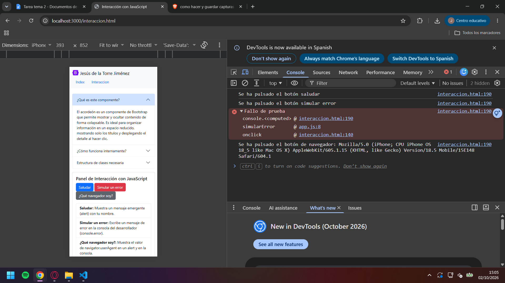
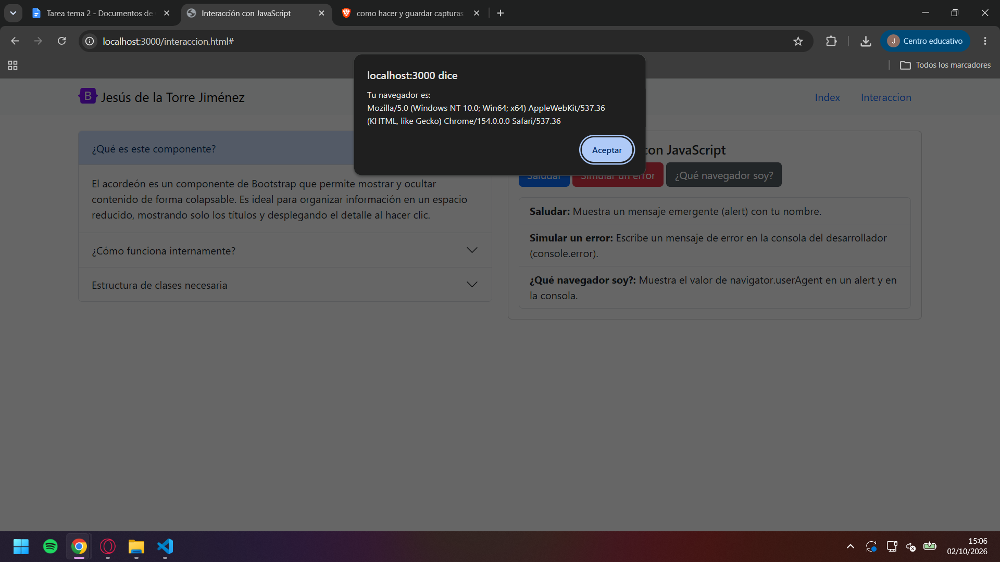
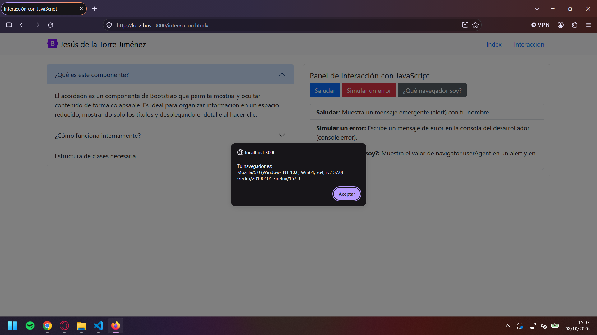
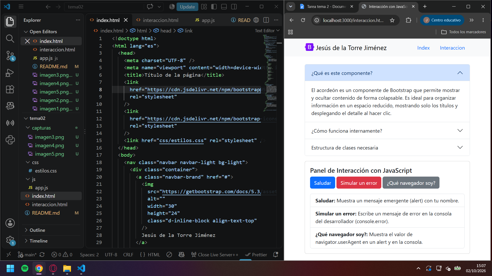

# Tarea Tema 2

## 1. Capturas de pantalla



En la imagen se ve la página principal de index.html con el nav en la parte superior, la tabla de navegadores y sus componentes y las tres cartas con información.



En la imagen se ve la página de interaccion.html junto a la consola de desarrolladores a la derecha. Hemos aplicado el formato de visualización movil para ver si responde dinámicamente la página.



En la imagen se ve la consola del desarrollador con 3 mensajes en consola. El primero es un console log con la traza de que el boton saludar ha sido pulsado, un fallo al pulsar el botón de simulación de fallos y una traza de que se ha pulsado el botón "que navegador soy" con la información del navegador actual.

### Chrome



En esta imagen vemos el modal de alerta con la información sobre el agente del navegador actual.

### Firefox



En esta imagen vemos el modal de alerta con la información sobre el agente del navegador actual esta vez ejecutada en firefox para posteriormente ver las diferencias entre ambos paneles de información.



En esta imagen vemos en la parte derecha el programa de Visual Studio code con la estructura de la carpeta del trabajo y a la derecha el servidor de la página ejecutado con liveserver++.

---

## 2. «Quién hace qué»: elige uno de tus botones y explica qué parte corresponde a HTML, qué aporta Bootstrap (CSS) y qué hace JavaScript.

HTML estructura la posición y la visibilidad del boton dentro de la página web. Posiciona el botón dentro de una serie de divs, pone el texto y permite lanzar la acción del “saludar”.

Bootstrap se localiza en las clases de los elementos HTML, arriba del todo (class="col-12 col-md-6 mb-3) establece una estructura a la página web dinámica cambiando los componentes que caben por fila dependiendo del dispositivo.

Javascript se ejecuta cuando se pulsa el boton que llama a la funcion js de “saludar” y es el responsable de lanzar el console.log y el modal de alerta con el texto del sonido.

3.Compara los dos userAgent que has obtenido: qué partes reconocen y por qué aparecen palabras como Mozilla, AppleWebKit o Safari aunque el navegador sea otro.

En ambos navegadores sale Mozilla/5.0 -(Windows NT 10.0; Win64; x64) - Sistema operativo (Windows 10 de 64 bits).

Aparece el sistema operativo, el motor de renderizado (Gecko/Mozilla) y el navegador en cuestión (Firefox).

```html
<div class="col-12 col-md-6 mb-3">
  <div class="card h-100">
    <div class="card-body">
      <h5 class="card-title">Panel de Interacción con JavaScript</h5>
      <p>
        <button class="btn btn-primary" onclick="saludar()">Saludar</button>
      </p>
    </div>
  </div>
</div>
```

```javascript
function saludar() {
  console.log("Se ha pulsado el botón saludar");
  alert("Hola Jesús de la Torre, esta es la prueba de modales en JS");
}
```

## 3. Compara los dos userAgent que has obtenido: qué partes reconoces y por qué aparecen palabras como Mozilla, AppleWebKit o Safari aunque el navegador sea otro.

La razón por la cual se ve Mozilla en todas viene desde los años 90 cuando el navegador principal era Mozilla. Las webs al detectar el agente solo daban las características completas si identificaban “Mozilla”. Por lo que todos los otros navegadores pusieron este código en su agent aunque no fuera cierto para tener compatibilidad.

Por una razón similar, chrome también especifica que usa Webkit y Safari aunque actualmente usen el motor de renderizado de blink (fork al Webkit de Apple).

## 4. Fuentes consultadas, con su enlace, y el apartado «Uso de IA» si corresponde.

https://caniuse.com/accent-color

https://thehistoryoftheweb.com/how-a-browser-engine-dominates-the-market/

«Uso de IA»
Se ha hecho uso de la IA para el entendimiento del funcionamiento de bootstrap, específicamente para .conteiner y .row. También como fuente para los textos sobre el navegador y accent-color. Y para el cambio de formato de texto a MD. Modelo Qwen 3.7 Max.
