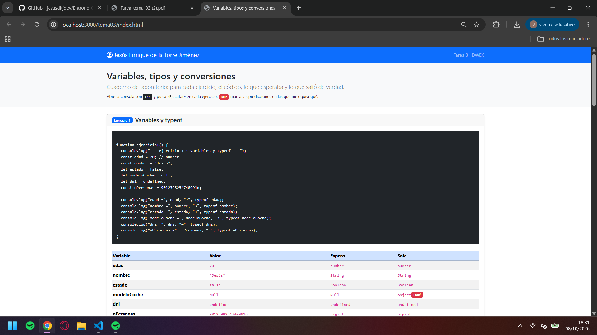
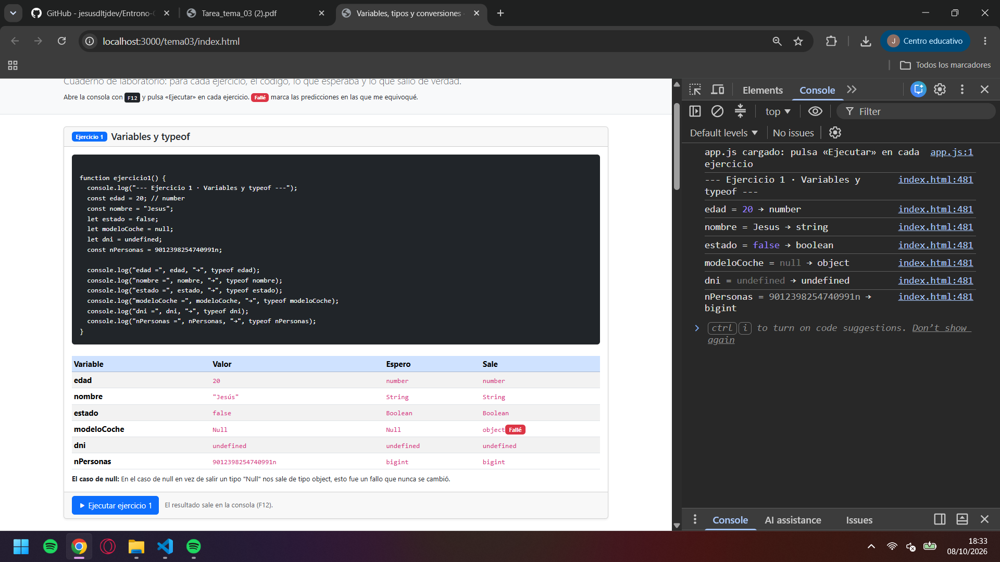
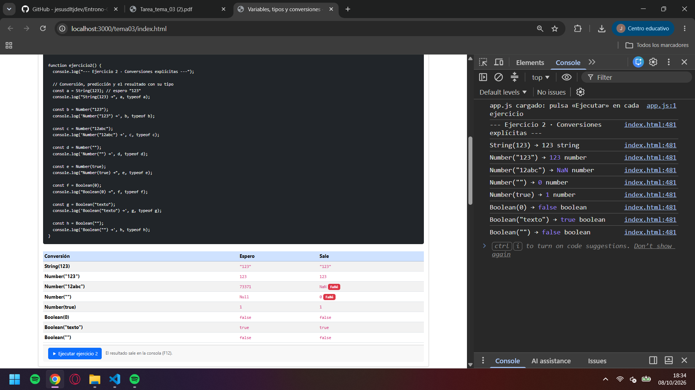
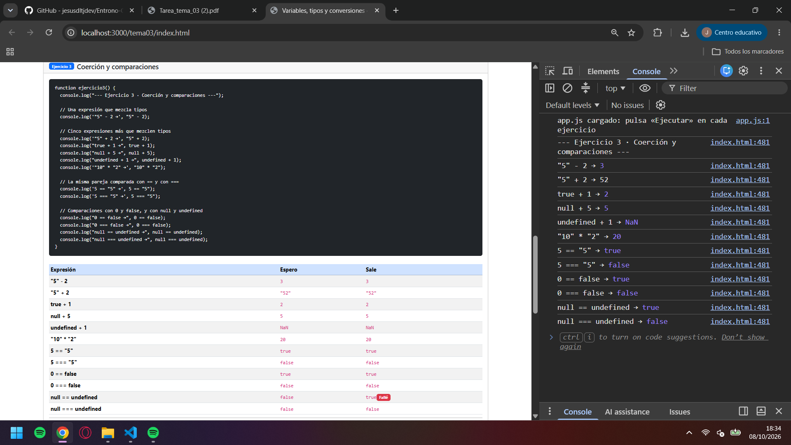
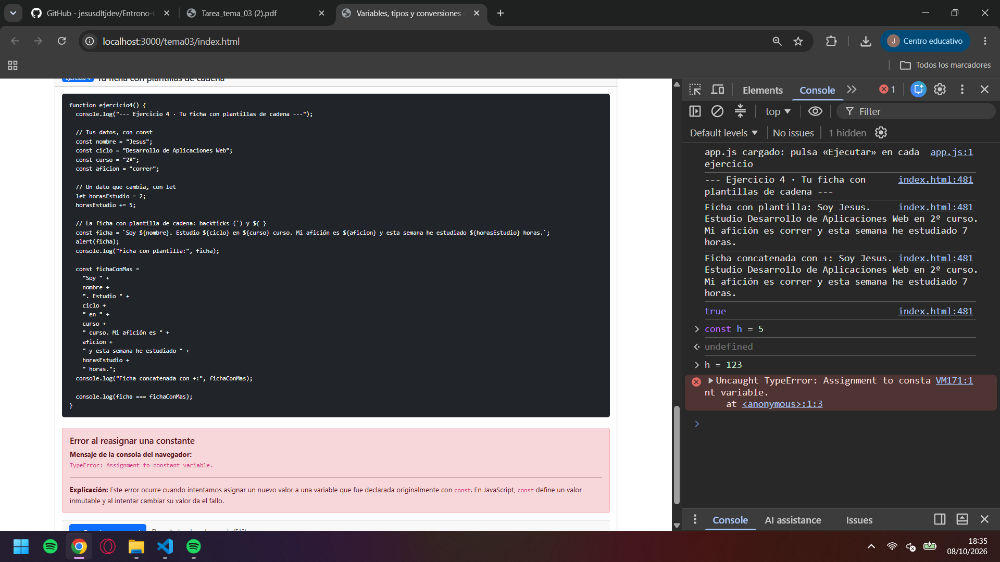

# Tarea 3 · Variables, tipos y conversiones

**Autor:** Jesús Enrique de la Torre Jiménez · Desarrollo Web en Entorno Cliente (DWEC) · 2.º DAW · Curso 2026-27

## Capturas

### a) La página entera

En la imagen se ve la composición de la página web. Un nav con el nombre del autor, el snippet de código y las tablas de conversiones con los errores hechos al intentar predecir el resultado.

### b) Consola del ejercicio 1

En la imagen se ve la consola con los logs del codigo de javascript comprobando el tipo de dato de las variables declaradas.

### c) Consola del ejercicio 2

En la imagen vemos el ejercicio de conversion de tipos y las predicciones del comportamiento de javascript. Hubo un fallo destacable al asumir el comportamiento en la transformación de un numero "12abc" por su traducción de hexadecimal a base 10 en vez de su comportamiento definiendo el valor como NaN.

### d) Consola del ejercicio 3

En la imagen se ve el ejercicio de coerción y comparaciones con los resultados en consola de las operaciones realizadas y sus resultados.

### e) Consola del ejercicio 4, con el error de la const

En la imagen se ve el ejercicio 4 de concatenación de cadenas. En la consola de desarrollador vemos el resultado del ejercicio y un error producido por intentar cambiar el valor de una constante (TypeError).

## Reflexión

El tipo de la variable con valor "Null", predecía un tipo especial llamado "Null" pero el interpretado por java es tipo objeto. Tras buscar en los apuntes el motivo se ve que fue un error antiguo que se mantuvo en las próximas versiones. La conversión de número("12abc") predije que lo interpretaría como un número en hexadecimal pero la conversión falla mostrando NaN. Por último me sorprendió la comparación simple de null == undefined dando "true" en la expresión lógica.

## Fuentes

- [Bootstrap Cards](https://getbootstrap.com/docs/5.0/components/card/)

- [Coddy Docs](https://coddy.tech/docs/es/javascript/null-vs-undefined)

## Uso de IA

Se ha hecho uso de la IA para ayudar en la elaboración del código y la redacción de la información dentro de la página web. MODELO: Qwen 3.7
